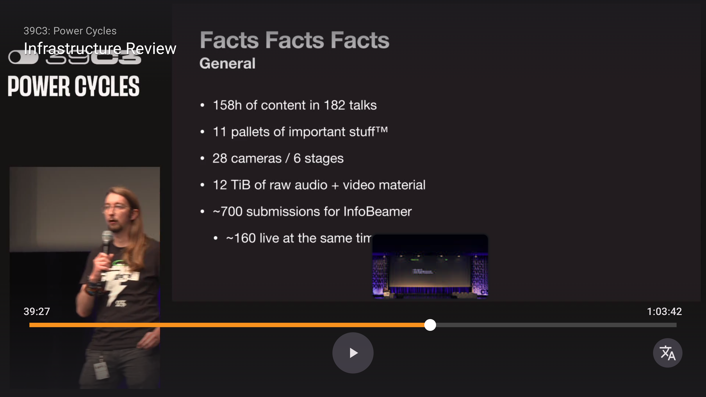
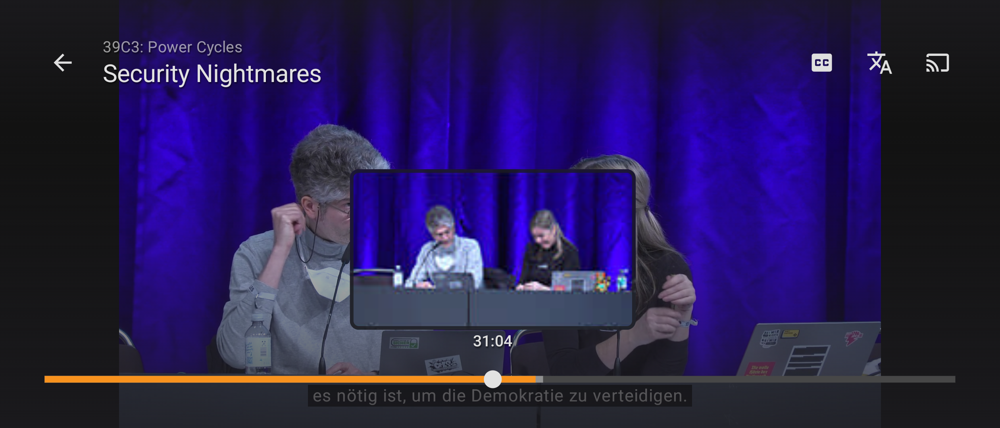
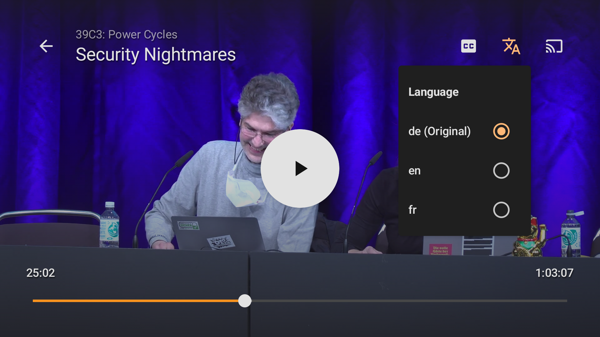
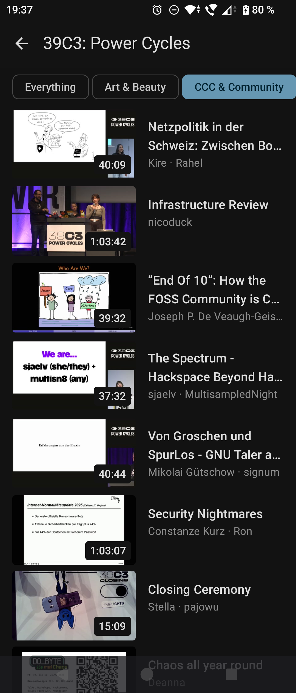

# VoctoTV

A stylish new AndroidTV client for media.ccc.de.

## Features

- Browse conferences, talks, documentaries and more.
- Choose audio language
- Seek through video with previews
- Subtitles (text/vtt and application/x-subrip)

## Roadmap

- Schedule integration (in the style of "Sendung verpasst?")
- Sort by popularity/genre

## Screenshots

### TV

### Smartphone

## License

> This Source Code Form is subject to the terms of the Mozilla Public License, v. 2.0.  
> If a copy of the MPL was not distributed with this file, You can obtain one at http://mozilla.org/MPL/2.0/.
